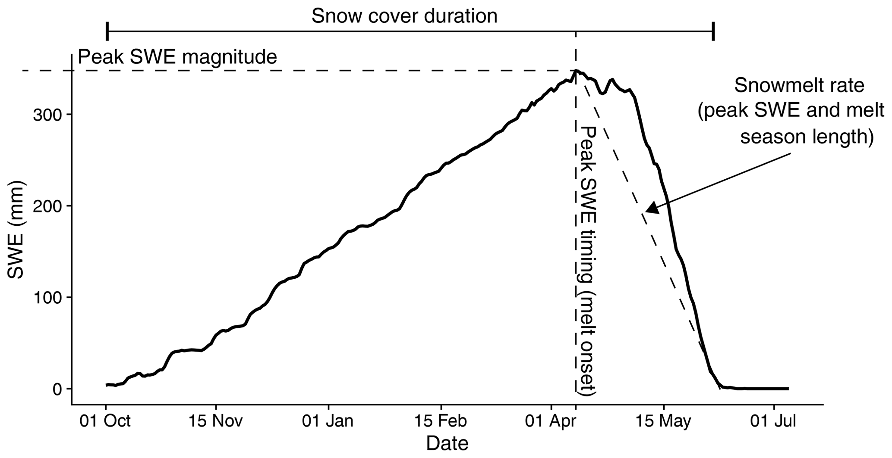

# Setting up R

First we need to load our packages. If you're missing any of the required ones, you have a couple install options. First, you can use the RStudio package interface for the most common, CRAN-accessible packages:


Or, you can run `install.packages` for whichever package(s) you need. Example: `install.packages("snotelr")`.

Let's load our required packages.

```{r}
library(tidyverse)
library(snotelr)
library(cowplot)
theme_set(theme_cowplot()) # setting the plot theme makes for cleaner figures
library(knitr)
```

# What is SNOTEL?

SNOTEL, for the uninitiated, is the Snow Telemetry network run by the US Department of Agriculture's Natural Resources Conservation Service (NRCS). The NRCS has sited these stations across the mountain west to better monitor snow water equivalent (SWE, the liquid depth of water contained in a snowpack if it were completely melted) and related climate variables such as air temperature and precipitation. 

Although it has its shortcomings, SNOTEL is the premier US snow dataset. Researchers use it for model development and validation, trend detection, process-based studies, and myriad other purposes. Water managers and other operations professionals rely on these data for water supply forecasts, making them incredibly valuable to decision-making in the arid and semi-arid west.

# Exploring snotelr

The snotelr package for R provides the functions we need to easily, reproducibly access SNOTEL data. First, let's see what stations we're working with by using the `snotel_info()` function.

```{r}
# Access the snotel metadata and save it as a dataframe
info <- snotel_info()

# View the top 5 lines
info %>% head()
```

Here we see information such as the network name, state, site name, start and end date of measurements, lat-lon, elevation, and the unique site id. We will use this information to downselect sites for further processing.

One of my favorite SNOTEL sites is Niwot in Colorado. We can view its metadata by filtering the info dataframe to just the single entry that contains the word "niwot" in the `site_name` column.

```{r}
info %>% filter(str_detect(site_name, "niwot"))
```

We see it's in Boulder County, Colorado at an elevation of 3030 m and its record runs from 1979-10-01 to present day.

We can next use the `snotel_download()` function to download all of Niwot's data.

```{r}
# Name the site_id
nwt_id = 663

# Download to a dataframe
df <- snotel_download(
  site_id = nwt_id,
  internal = TRUE    # save the file to R workspace (can also be saved locally)
)

```

A quick look at the data reveals the information snotelr can provide from the SNOTEL network:

```{r}
df %>% head()
```

In this file we see a fair amount of redundant information from the site metadata (we'll strip this out later) along with new data such as `snow_water_equivalent`, `snow_depth`, `temperature_min/max/mean`, and `precipitation`. In the next section we'll start working with these data.

# Processing and analyzing SNOTEL data

One of the first things we'll do is strip out the redundant information (keeping only the `site_id` column for later joining with the metadata) and process the date info.

```{r}
# Select the columns we want
df <- df %>% 
  select(site_id:precipitation)

# Format the date
df <- df %>% 
  mutate(date = ymd(date))

# Create a water year function
# Requires the lubridate package loaded under tidyverse
wateryear <- function(date){
  ifelse(month(date) >= 10,
         year(date) + 1,
         year(date))
}

# Create a day of water year function 
# Requires the lubridate package loaded under tidyverse
day_of_wateryear <- function(date){
  ifelse(year(date) %% 4 != 0,
         ifelse(month(date) >= 10,
                yday(date) - 273,
                yday(date) + 92),
         ifelse(month(date) >= 10,
                yday(date) - 274,
                yday(date) + 92))
}

# Add a water year column to the dataset
df <- df %>% 
  mutate(wyear = wateryear(date),
         dowy = day_of_wateryear(date))

```

Now that we've formatted the date, we can plot SWE data.

```{r}
ggplot(df, aes(date, snow_water_equivalent)) + 
  geom_line()
```

Hmm, that's no good unless you like looking at squiggly migraine lines. Let's plot a single year of data instead and add some axes info.

```{r}
plot_yr = 2025
df %>% 
  filter(wyear == plot_yr) %>% 
  ggplot(aes(date, snow_water_equivalent)) +
  geom_line() + 
  labs(x = "Date",
       y = "SWE (mm)")
```

This is what snow hydrologists call a niveograph (like a hydrograph for snow) where the date is on the x-axis and SWE is on the y-axis.

A niveograph tells us all sorts of information about a snowpack.



The above plot from Jennings and Molotch (2019) shows a few simple metrics that we can compute from SWE data on a niveograph. A few others include the accumulation and melt seasons (pre- and post-peak SWE, respectively), snowmelt center of mass (when 50% of peak SWE has melted), and snow-on and snow-off dates (when the period of consistent, or continuous, snow cover begins and ends). We'll dive more into these metrics later.

Suffice it to say we will see inter-year differences. Take, for example, 2011 vs. 2012:

```{r}
plot_yrs = c(2011,2012)
df %>% 
  filter(wyear %in% plot_yrs) %>% 
  ggplot(aes(dowy, snow_water_equivalent, color = as.factor(wyear))) +
  geom_line() + 
  labs(x = "Day of Water Year",
       y = "SWE (mm)") +
  scale_color_manual(values = c("#0072B2", "#E69F00"),
                     name = "Water\nYear") +
  theme(legend.position = c(0.8, 0.8))
```

A glance at the above plot tells us a couple obvious things:

1. 2011 had a higher, later peak SWE than 2012
2. 2011 had more snow covered days than 2012

Rather than just visually assessing the data we can quantify it:

```{r}
df %>% 
  filter(wyear %in% plot_yrs) %>% 
  group_by(wyear) %>% 
  summarize(max_swe = max(snow_water_equivalent),
            max_swe_dowy = which.max(snow_water_equivalent),
            snow_off_dowy = min(which(snow_water_equivalent == 0 & dowy > max_swe_dowy)),
            melt_season_days = as.numeric(snow_off_dowy - max_swe_dowy),
            melt_rate = max_swe / melt_season_days) %>% 
  mutate(across(where(is.numeric), ~ round(.x, 1))) %>% 
  kable(col.names = c("Water Year", "Max SWE (mm)", "Max SWE DOWY", 
                      "Snow Off DOWY", "Melt Season (d)", "Melt Rate (mm/d)"))

```

In the next notebook, we'll take this form of analysis a step further and produce a series of metrics for multiple sites using R functions we create. Before that, though, we'll look at some other SNOTEL data that is available via `snotelr` and a URL-builder approach.

# Other SNOTEL variables

## From snotelr

The `snotelr` package also retrieves ancillary met data like air temperature and precipitation (both incremental and cumulative).

```{r}
plot_grid(
  df %>% 
  filter(wyear == plot_yr) %>% 
  ggplot(aes(date, temperature_mean)) +
  geom_line() + 
  labs(x = "Date",
       y = "Mean Daily Air Temperature (°C)"),
  df %>% 
  filter(wyear == plot_yr) %>% 
  ggplot(aes(date, precipitation)) +
  geom_bar(stat = "identity") + 
  labs(x = "Date",
       y = "Daily Precipitation (mm)"),
  ncol = 2
)
```

In fact, we can view the cumulative precip data from the two snow years plotted above to see the difference between a drought and non-drought year.

```{r}
df %>% 
  filter(wyear %in% plot_yrs) %>% 
  ggplot(aes(dowy, precipitation_cumulative, color = as.factor(wyear))) +
  geom_line() + 
  labs(x = "Day of Water Year",
       y = "Cumulative Precipitation (mm)") +
  scale_color_manual(values = c("#0072B2", "#E69F00"),
                     name = "Water\nYear") +
  theme(legend.position = c(0.1, 0.8))
```

In 2012 there were long stretches of zero precipitation. It was a *dry* snow drought. There are also *warm* snow droughts. We can explore this concept further in the synchrony work if needed.

## SNOTEL data URLs

Another, non-snotelr way to get SNOTEL data is to build a URL that accesses it. (You can also use the [SNOTEL API](wcc.sc.egov.usda.gov/awdbRestApi/swagger-ui/index.html#/Data/getData) if you want to play around with different URL structures.)

```{r}
# This functions downloads all of the available sensor data
# If you want just the regular SNOTEL met and snow data, replace "report=ALL" with "report=STAND"
allDownload <- function(ID, WYEAR){
  dl1 = "https://wcc.sc.egov.usda.gov/nwcc/view?intervalType=Historic+&report=ALL&timeseries=Daily&format=copy&sitenum="
  dl2 = "&year="
  dl3 = "&month=WY"
  read.csv(url(paste0(dl1,
                      ID,
                      dl2,
                      WYEAR,
                      dl3)),
           stringsAsFactors = F,
           skip = 6, na.strings = "-99.9")
}
```

Here, all we need to do is supply the site ID and the water year(s):

```{r}
new_site = 784
new_years = c(2015, 2019)
new_df <- map_dfr(new_years, ~ allDownload(ID = new_site, WYEAR = .x))
```

A look at the data shows some new columns, with very ugly names:

```{r}
new_df %>% 
  head()
```

The columns starting with `SMS` and `STO` correspond to soil moisture and temperature, respectively, from different levels beneath the ground surface. The numbers (e.g., 2, 8, 20) in the column names correspond to the sensors depths in inches. Yes, inches. 

Like we did previously, we'll add some date information and visualize the data.

```{r}
# Format the date and add wy info
new_df <- new_df %>% 
  mutate(date = ymd(Date),
         wyear = wateryear(date),
         dowy = day_of_wateryear(date))
```

Because this is a new site, Palisades Tahoe in CA's Sierra Nevada, we'll look at SWE from a good (2019) and bad (2015) snow year. 

```{r}
new_df %>% 
  ggplot(aes(dowy, WTEQ.I.1..in., color = as.factor(wyear))) +
  geom_line() + 
  labs(x = "Day of Water Year",
       y = "SWE (mm)") +
  scale_color_manual(values = c("#0072B2", "#E69F00"),
                     name = "Water\nYear") +
  theme(legend.position = c(0.8, 0.8))
```

Fortunately, we lived in Reno in 2019 and not 2015. 

We can also plot the different depths of soil moisture.

```{r}
# Plot the soil moisture traces
plot_grid(
  new_df %>% 
    ggplot(aes(dowy, SMS.I.1..2..pct....silt., color = as.factor(wyear))) +
    geom_line() + 
    scale_color_manual(values = c("#0072B2", "#E69F00"),
                     name = "Water\nYear") +
    labs(x = "Day of Water Year", y = "2-inch\nSoil Moisture\n(%)"),
  new_df %>% 
    ggplot(aes(dowy, SMS.I.1..8..pct....silt., color = as.factor(wyear))) +
    geom_line() + 
    scale_color_manual(values = c("#0072B2", "#E69F00"),
                     name = "Water\nYear") +
    labs(x = "Day of Water Year", y = "8-inch\nSoil Moisture\n(%)"),
  new_df %>% 
    ggplot(aes(dowy, SMS.I.1..20..pct....silt., color = as.factor(wyear))) +
    geom_line() + 
    scale_color_manual(values = c("#0072B2", "#E69F00"),
                     name = "Water\nYear") +
    labs(x = "Day of Water Year", y = "20-inch\nSoil Moisture\n(%)"),
  ncol = 1
)
```

Let's move on now to computing snow metrics across sites and water years for our synchrony work.


# Further reading and info

- [snotelr R package](https://cran.r-project.org/web/packages/snotelr/index.html)
- [SNOTEL website](https://www.nrcs.usda.gov/resources/data-and-reports/snow-and-climate-monitoring-predefined-reports-and-maps)
- Jennings, K. S., & Molotch, N. P. (2019). The sensitivity of modeled snow accumulation and melt to precipitation phase methods across a climatic gradient. Hydrology and Earth System Sciences, 23(9), 3765-3786.  <https://doi.org/10.5194/hess-23-3765-2019>